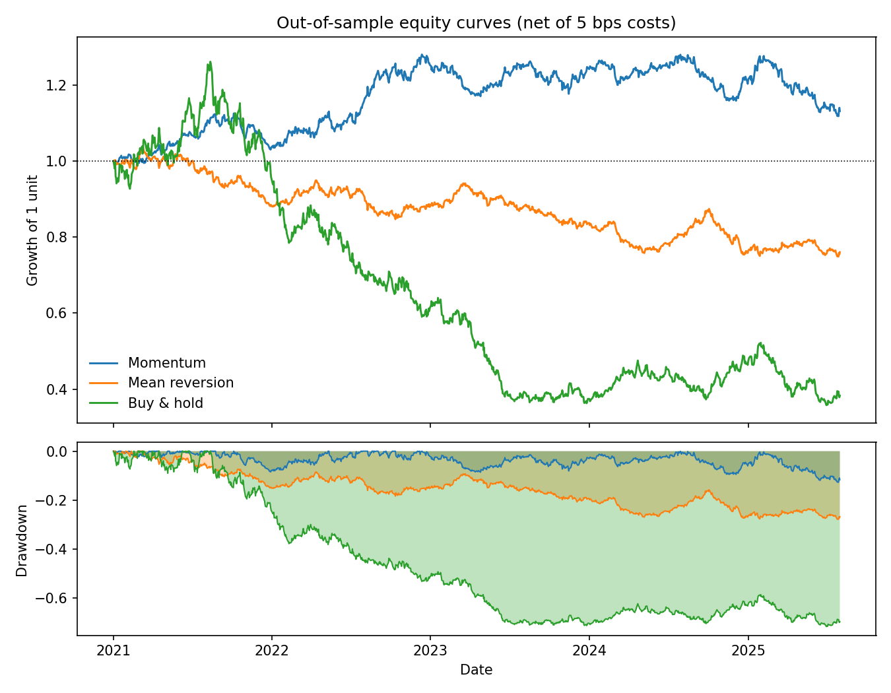
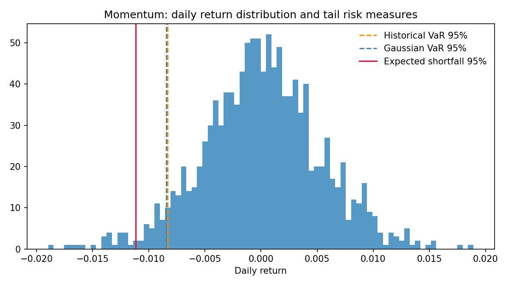

# Quant Backtesting & Risk Framework

Un framework de backtest de stratégies systématiques, construit autour d'une
idée simple : **la plupart des backtests mentent**, et la valeur d'un framework
tient à ce qu'il rend ce mensonge impossible.

Trois garde-fous sont câblés dans le code plutôt que laissés à la discipline
de l'utilisateur : pas de look-ahead, split strictement chronologique, coûts
de transaction activés par défaut.

## Résultat le plus parlant

Sur l'échantillon out-of-sample, la stratégie de mean reversion est
**profitable brute et perdante nette** :

| Stratégie | Rendement brut | Rendement net | Coût de friction |
|---|---|---|---|
| Momentum | +4,04 % | **+2,64 %** | 1,40 % |
| Mean reversion | +2,04 % | **−5,62 %** | 7,66 % |
| Buy & hold | −18,32 % | −18,32 % | 0,00 % |

La mean reversion rebalance quotidiennement sur un horizon de 5 jours : son
turnover est tel que 5 points de base de coût par transaction suffisent à
transformer un edge réel en perte sèche. Un backtest sans modèle de coût
aurait affiché un signal "qui marche".

## Performance out-of-sample (nette de coûts)

| | Rdt ann. | Vol ann. | Sharpe | Sortino | Max DD | VaR 95% | ES 95% |
|---|---|---|---|---|---|---|---|
| Momentum | 2,64 % | 8,27 % | 0,36 | 0,36 | −12,7 % | 0,83 % | 1,11 % |
| Mean reversion | −5,62 % | 8,11 % | −0,67 | −0,66 | −27,8 % | 0,87 % | 1,10 % |
| Buy & hold | −18,32 % | 22,67 % | −0,78 | −0,75 | −71,6 % | 2,49 % | 3,03 % |



## Stabilité walk-forward

Le Sharpe du momentum décroît fold après fold, jusqu'à devenir négatif sur le
dernier bloc :

| Fold | Début OOS | Sharpe | Rdt ann. | Max DD |
|---|---|---|---|---|
| 1 | 2017-11-30 | 0,25 | 1,7 % | −13,3 % |
| 2 | 2019-10-31 | 0,32 | 2,3 % | −12,7 % |
| 3 | 2021-09-30 | 0,09 | 0,4 % | −12,7 % |
| 4 | 2023-08-31 | −0,42 | −3,8 % | −12,6 % |

Rapporter la moyenne des folds aurait donné un Sharpe positif rassurant. La
dispersion est l'information utile : un edge qui ne survit pas au dernier
fold n'est pas un edge exploitable.

## Mesures de risque de queue



Les trois mesures sont reportées ensemble parce qu'elles divergent là où ça
compte. Sur un échantillon à queues épaisses (Student t, 3 ddl) :

- **à 95 %**, la VaR gaussienne est la *plus grande* des deux — les queues
  épaisses gonflent l'écart-type empirique, ce qui repousse le quantile
  gaussien au-delà du quantile empirique ;
- **à 99,9 %**, l'ordre s'inverse nettement et la VaR gaussienne sous-estime
  la perte réelle d'un facteur supérieur à 1,5.

Le croisement se situe autour du niveau 98 %. C'est précisément pourquoi
citer "la VaR" sans préciser le niveau ni la méthode ne veut rien dire, et
pourquoi l'expected shortfall (cohérente, sous-additive) complète les deux.

## Les trois garde-fous, et comment ils sont testés

**1. Pas de look-ahead.** Chaque signal est décalé d'un jour (`.shift(1)`)
avant d'être appliqué aux rendements. Le test `test_no_lookahead_in_signals`
tronque l'historique de prix et vérifie qu'aucune valeur de signal antérieure
ne change : si un signal regardait le futur, tronquer la fin modifierait le
passé.

**2. Split chronologique.** `train_test_split` coupe par date, jamais par
échantillonnage aléatoire. Il n'existe volontairement aucune option
`shuffle=True` dans ce repo : mélanger une série temporelle laisse le modèle
voir des prix futurs pendant l'ajustement, ce qui est la première cause d'un
backtest brillant sur le papier et mort en production.

**3. Coûts de transaction par défaut.** Le turnover est facturé à chaque
rebalancement, à 5 bps du notionnel échangé. Le paramètre est activé par
défaut, pas optionnel — voir le tableau brut/net ci-dessus pour la raison.

Un quatrième point s'est révélé à l'écriture des tests : la construction
naïve des poids par rangs centiles n'est **pas** dollar-neutre sur un univers
fini (avec 5 actifs, les rangs valent 0,2 … 1,0, de moyenne 0,6), ce qui
laissait un biais long systématique. Les rangs bruts sont désormais centrés
transversalement, et `test_dollar_neutral_weights_sum_to_zero` verrouille la
propriété.

## Contenu

| Module | Rôle |
|---|---|
| `src/data_loader.py` | Prix synthétiques GBM reproductibles (offline) ou réels via `yfinance` |
| `src/strategies.py` | Momentum et mean reversion transversaux, dollar-neutres |
| `src/backtester.py` | Moteur de backtest, coûts, split chronologique, walk-forward |
| `src/risk_metrics.py` | Sharpe, Sortino, Calmar, max drawdown, VaR historique/gaussienne, expected shortfall |
| `notebooks/demo_backtest.py` | Démo end-to-end, produit les tableaux et figures ci-dessus |
| `tests/test_framework.py` | 10 tests, dont les invariants anti-look-ahead |

## Installation et exécution

```bash
pip install -r requirements.txt
pytest tests/ -v
python notebooks/demo_backtest.py
```

Les données par défaut sont simulées et graînées (`seed=42`), donc tous les
chiffres de ce README sont reproductibles à l'identique sans accès réseau.
Pour travailler sur données réelles :

```python
from src.data_loader import load_yahoo
prices = load_yahoo(["AAPL", "MSFT", "JPM", "XOM", "JNJ"], start="2016-01-01")
```

## Utilisation

```python
from src.data_loader import load_synthetic
from src.strategies import momentum_signal
from src.backtester import run_backtest, train_test_split

prices = load_synthetic(n_days=2500, seed=42)
train, test = train_test_split(prices, "2021-01-01")

weights = momentum_signal(prices).reindex(test.index)
result = run_backtest(test, weights, cost_bps=5.0)

print(result.metrics["sharpe"], result.metrics["max_drawdown"])
```

## Limites assumées

- Les prix par défaut sont simulés sous GBM : volatilité constante, pas de
  sauts, pas de changement de régime. Les niveaux de performance ci-dessus
  n'ont donc aucune valeur prédictive — c'est le *comportement du framework*
  qui est démontré, pas la rentabilité d'un signal.
- Le modèle de coût est linéaire en turnover et ignore l'impact de marché,
  qui domine à taille de position élevée.
- Pas de contrainte de levier, de capacité, ni de borne sectorielle.

## Prochaines étapes

- Modèle de coût non linéaire avec impact de marché (racine carrée du volume)
- Optimisation de portefeuille sous contrainte (mean-variance, risk parity)
- Détection de régime (HMM, clustering) pour conditionner l'allocation
